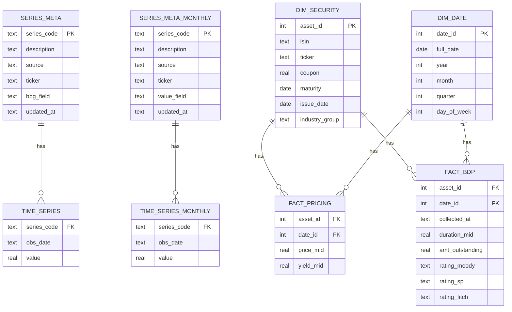

# Documentação Market Update

Sistema de atualização automática de um banco SQLite (`market_update.db`) com séries de mercado (Bloomberg, FRED), séries macro de frequência mensal (CPI/FRBSF, IPCA/BCB) e dados de bonds (Bloomberg, em star schema).

## Visão geral

O projeto roda três ETLs independentes, agendados no Windows Task Scheduler, cada um lendo suas próprias tabelas de metadados/dimensão para saber **o que** buscar e **onde** buscar:

| ETL | Scripts | Frequência | Fontes | Tabelas |
|---|---|---|---|---|
| Diário | `market_update.py` | de hora em hora (dias úteis) | Bloomberg (via `xbbg`), FRED | `series_meta` → `time_series` |
| Mensal | `monthly_update.py` | 1x por dia às 10:00 (dias úteis) | FRBSF (Excel), BCB/SGS (JSON) | `series_meta_monthly` → `time_series_monthly` |
| Bonds | `update_dim_security.py`, `update_fact_pricing.py` | de hora em hora (terça a sexta) | Bloomberg (via Excel/BSRCH e `xbbg`) | `dim_security`, `dim_date` → `fact_pricing` |

A ideia central do projeto é: **o código não sabe nada sobre séries/ativos específicos — ele só sabe ler metadados/dimensões e executar a fonte correspondente**. Adicionar uma série nova (Bloomberg, FRED, FRBSF ou BCB) é inserir uma linha na tabela de metadados certa; não é preciso alterar os scripts de ETL. Para bonds, o cadastro de novos ativos é automático a partir de uma busca (SRCH) mantida no terminal Bloomberg.

## Diagrama do banco

O banco tem três blocos independentes entre si (nenhuma FK cruza os blocos): séries diárias, séries mensais, e o star schema de bonds.



## Estrutura do banco

### `series_meta` (diário) — o coração da atualização diária

Cada linha descreve **uma série** e diz ao `market_update.py` como buscá-la:

| Coluna | Significado |
|---|---|
| `series_code` | Chave interna da série (PK), usada em `time_series.series_code` |
| `description` | Descrição livre |
| `source` | `'BBG'` ou `'FRED'` — decide qual bloco do ETL processa a série |
| `ticker` | Ticker Bloomberg (source=BBG) ou ID da série no FRED (source=FRED) |
| `bbg_field` | Campo Bloomberg a puxar (`px_last`, `yield`, ...). Nulo para FRED |
| `updated_at` | Timestamp da última atualização do metadado |

O `bbg_field` é mapeado para o campo real da Bloomberg (`px_last`, `YLD_YTM_MID`, etc.) pelo dicionário `MAPEAMENTO_BBG` dentro do próprio `market_update.py`. Se aparecer um `bbg_field` novo que não exista nesse dicionário, o ETL **pula** as séries daquele campo e loga erro — ele não tenta adivinhar.

### `series_meta_monthly` (mensal) — o mesmo papel, para dados mensais

| Coluna | Significado |
|---|---|
| `series_code` | Chave interna da série (PK) |
| `description` | Descrição livre |
| `source` | `'FRBSF'` ou `'BCB'` — decide qual fetcher processa a série |
| `ticker` | Código da série (ex: usado quando source=BCB) |
| `value_field` | Nome da coluna de valor na planilha da fonte (ex: usado quando source=FRBSF) |
| `updated_at` | Timestamp da última atualização do metadado |

### `time_series` e `time_series_monthly` — os valores

Ambas seguem o mesmo formato "longo" (uma linha por série + data):

```
series_code | obs_date | value
```

Chave primária composta `(series_code, obs_date)`. `time_series` tem granularidade diária; `time_series_monthly` tem granularidade mensal (sempre dia 1 do mês, `YYYY-MM-01`).

### `dim_security` — cadastro estático dos bonds

Guarda os dados de um bond que **não mudam com o tempo** (ou mudam raramente): cupom, vencimento, data de emissão, setor. Cada linha é um ativo, identificado pelo ISIN.

| Coluna | Significado |
|---|---|
| `asset_id` | Chave interna autoincrement (PK) |
| `isin` | ISIN do bond (UNIQUE — chave de deduplicação) |
| `ticker` | Ticker Bloomberg |
| `coupon` | Taxa de cupom |
| `maturity` | Data de vencimento |
| `issue_date` | Data de emissão |
| `industry_group` | Setor/indústria (classificação BICS) |

Populada por `update_dim_security.py`. Novos ativos entram via `INSERT OR IGNORE` — se um ISIN já cadastrado tiver algum campo alterado na Bloomberg (ex: reclassificação de setor), essa mudança **não é refletida automaticamente**; o registro existente é preservado como estava no primeiro cadastro. Isso é intencional para os campos verdadeiramente estáticos (ISIN, cupom, datas), mas vale ter em mente para `industry_group`, que ocasionalmente é reclassificado pela Bloomberg.

### `dim_date` — calendário

Uma linha por data de referência já usada em `fact_pricing`, com atributos derivados (ano, mês, trimestre, dia da semana) para facilitar agregações. Populada automaticamente pelo `update_fact_pricing.py` conforme necessário.

### `fact_pricing` e `fact_bdp` — dados de mercado dos bonds

Os dados dinâmicos dos bonds são divididos em duas tabelas de fatos para separar cotações de fechamento (históricas) de atributos que sofrem alterações esporádicas (snapshots):

#### `fact_pricing` (Atualização via BDH)

Guarda as cotações de fechamento (série temporal) ancoradas sempre na segunda-feira da semana de referência.

| Coluna | Significado |
|---|---|
| `asset_id` | FK para dim_security |
| `date_id` | FK para dim_date (Sempre aponta para uma segunda-feira) |
| `price_mid` | Preço mid de fechamento |
| `yield_mid` | Yield to maturity mid de fechamento |

Chave primária composta (asset_id, date_id).

#### `fact_bdp` (Atualização via BDP)

Guarda o "snapshot" (foto do momento da coleta) de atributos estáticos-mas-variáveis dos bonds.

| Coluna | Significado |
|---|---|
| `asset_id` | FK para dim_security
| `date_id` | FK para dim_date (Data real do dia em que a coleta foi feita)
| `collected_at` | Timestamp exato da coleta (Ex: 2026-09-04 10:35:00)
| `duration_mid` | Duration mid atual
| `amt_outstanding` | Montante em aberto (em milhões)
| `rating_moody, rating_sp, rating_fitch` | Ratings atuais das três agências

Chave primária composta (asset_id, date_id).

## Como cada ETL decide o que buscar

### Diário — `market_update.py`

1. Testa se o terminal Bloomberg está logado (`blp.bdp`). Se não estiver, **aborta a execução inteira** (não tenta nem BBG nem FRED) — é um "portão" de segurança para não gravar dados incompletos.
2. Lê `series_meta` filtrando `source='BBG'`, agrupa por `bbg_field`, resolve o campo Bloomberg real via `MAPEAMENTO_BBG`, descobre a data inicial de cada série (dia seguinte ao último `obs_date` salvo) e baixa via `blp.bdh`.
3. Lê `series_meta` filtrando `source='FRED'`, baixa o CSV público de cada série a partir da data inicial, preenchendo gaps de fim de semana/feriado com o último valor conhecido (replicando o comportamento `fill=PREV` da Bloomberg).
4. Grava tudo com `INSERT OR IGNORE` em `time_series` — nunca sobrescreve um valor já existente, só adiciona o que é novo.
5. Sempre busca a partir do dia seguinte ao último dado salvo; se já está atualizado até D-1, pula a série sem tocar na rede.

### Mensal — `monthly_update.py`

1. Lê `series_meta_monthly` inteira.
2. Para cada linha, despacha para o fetcher correspondente ao `source` (`fetch_frbsf_cpi` ou `fetch_bcb_sgs`).
3. Cada fetcher devolve um DataFrame padronizado (`series_code`, `obs_date`, `value`).
4. Grava com `INSERT ... ON CONFLICT DO UPDATE` em `time_series_monthly` — diferente do diário, aqui o **último ponto é sempre reenviado e sobrescrito**, porque CPI e IPCA sofrem revisão retroativa com frequência.
5. Falha em uma série não interrompe as demais (loga e continua).

### Bonds — `update_dim_security.py` + `update_fact_pricing.py`

O fluxo é em duas etapas, cadastro seguido de cotação, porque `fact_pricing` e `fact_bdp` dependem de `dim_security` já ter o ativo (FK).

**1. `update_dim_security.py`** — descoberta e cadastro de novos ativos:

1. Abre `new_issues.xlsx` de forma invisível via `win32com` (Excel Automation) e força o recálculo. A célula A1 contém a fórmula BSRCH do add-in Bloomberg, apontando para uma busca (SRCH) salva no terminal; ao recalcular, a coluna A se preenche com os ISINs encontrados, com "id" como cabeçalho.
   > Nota: BSRCH via `xbbg` não funcionou de forma confiável para o SRCH usado neste projeto — por isso o acesso é feito via automação do Excel/add-in em vez da biblioteca Python.
2. Faz polling na célula A1 (até ~30 tentativas, 1s cada) esperando a Bloomberg responder, e lê a coluna A até encontrar uma célula vazia, coletando a lista de ISINs.
3. Compara essa lista com os ISINs já existentes em `dim_security` e identifica os novos.
4. Para os ISINs novos, busca campos estáticos na Bloomberg (`blp.bdp`) e insere em `dim_security` via `INSERT OR IGNORE`.

**2. `update_fact_pricing.py`** —  atualização semanal das cotações e atributos:

Este script trata `fact_pricing` (BDH) e `fact_bdp` (BDP) como duas atualizações independentes, ambas rodando uma vez por semana (embora o script seja acionado de hora em hora de terça a sexta):

1. `fact_pricing` (Cotações via BDH):

- Ancora a atualização sempre na segunda-feira da semana corrente.
- Se já existe registro em `fact_pricing` para a date_id dessa segunda-feira, a etapa é pulada.
- Caso contrário, usa uma pequena amostra de ativos para verificar se houve pregão na segunda-feira. Se foi feriado (sem dados), recua automaticamente até 5 dias úteis para encontrar o fechamento válido mais recente.
- Busca preço/yield para todos os ISINs da dim_security e grava o resultado sob o date_id da segunda-feira (mesmo que o dado real tenha vindo do fallback de sexta).

2. `fact_bdp` (Snapshot via BDP):
- Realiza uma checagem semanal por janela: verifica se já existe algum registro na tabela `fact_bdp` com um date_id pertencente à semana atual (entre segunda e domingo).
- Se já existir, a coleta é pulada (economizando chamadas à API da Bloomberg).
- Se não existir (primeira execução bem-sucedida da semana), faz um snapshot instantâneo (blp.bdp) de duration, amount outstanding e ratings para todos os bonds.
- Os dados são salvos usando a data real do dia da execução (date_id_hoje) e o horário exato da coleta (collected_at), desvinculando-se do fallback de feriados do BDH.

3. Gravação Segura: Ambas as inserções utilizam tabelas de staging temporárias (`fact_pricing_temp`, `fact_bdp_temp`) seguidas de um INSERT OR REPLACE, garantindo transações limpas e mantendo o processo idempotente.


## Adicionando uma série ou ativo novo

- **Bloomberg/FRED (diário)**: inserir uma linha em `series_meta` com `source`, `ticker` e (se BBG) `bbg_field`. Se o `bbg_field` for novo, adicionar o mapeamento correspondente em `MAPEAMENTO_BBG` no `market_update.py`.
- **FRBSF/BCB (mensal)**: inserir uma linha em `series_meta_monthly` (via `seed_series_meta_monthly.py`) com `source`, e `ticker` (BCB) ou `value_field` (FRBSF).
- **Fonte totalmente nova (mensal)**: escrever um novo fetcher em `monthly_update.py` com a assinatura `(meta_row: dict) -> DataFrame[series_code, obs_date, value]` e registrá-lo no dicionário `FETCHERS`.
- **Bonds novos**: não precisa de ação manual — basta o ativo aparecer no resultado do SRCH configurado no terminal Bloomberg. O `update_dim_security.py` detecta e cadastra automaticamente na próxima execução semanal.

## Automação (Windows Task Scheduler)

Três `.bat` independentes, cada um com seu próprio lockfile (evita execução concorrente) e log próprio em `logs/`:

| Tarefa | Script | Trigger | Lockfile | Log |
|---|---|---|---|---|
| Diário | `run_daily.bat` | de hora em hora | `run_market_update.lock` | `logs/run_bat.log` |
| Mensal | `run_monthly.bat` | 1x por dia | `run_monthly_update.lock` | `logs/run_bat_monthly.log` |
| Bonds | `run_fact_update.bat` | 1x por dia | `run_fact_update.lock` | `logs/run_fact_update.log` |

As três tarefas são independentes entre si — uma falhar não afeta as outras. Cada script Python também mantém seu próprio log detalhado em `logs/` (`atualizador_dados.log`, `atualizador_dados_mensais.log`, `atualizador_dim_security.log`, `atualizador_fact_pricing.log`).

No `.bat` de bonds, os dois scripts rodam em sequência e cada etapa aborta a execução (mantendo o lockfile removido, mas retornando erro) se a etapa anterior falhar — isso evita rodar `update_fact_pricing.py` caso `update_dim_security.py` não tenha conseguido cadastrar ativos novos corretamente.

## Observações importantes

- Todos os ETLs são **idempotentes**: rodar de novo não duplica dados. O diário ignora datas já existentes; o mensal sobrescreve o último ponto (por causa de revisões) mas não duplica linhas; o de bonds ignora ISINs já cadastrados em `dim_security` e faz upsert em `fact_pricing` por `(asset_id, date_id)`.
- O schema inteiro (todas as tabelas) é criado via `CREATE TABLE IF NOT EXISTS`, então rodar o script de criação de novo nunca apaga dados existentes.
- Os metadados (`series_meta`, `series_meta_monthly`) e a dimensão de ativos (`dim_security`, alimentada pelo SRCH da Bloomberg) são a única coisa que precisa ser mantida/observada no dia a dia — os scripts de ETL raramente precisam mudar.
- O bloco de bonds depende de dois recursos externos ao banco: o arquivo `new_issues.xlsx` (com a fórmula BSRCH) e o SRCH salvo no terminal Bloomberg. Se o SRCH for alterado ou removido no terminal, o cadastro de novos ativos para de funcionar silenciosamente (a função retorna lista vazia e o ETL simplesmente não encontra nada novo).